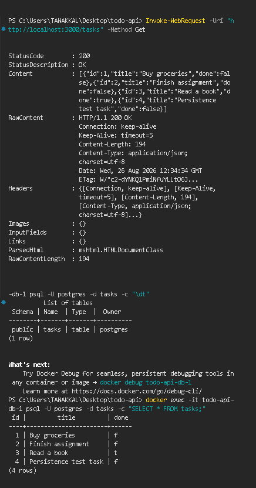

# Task API

A CRUD API for managing a to-do list, built with Node.js and Express.
Data is stored in a **PostgreSQL** database running inside a **Docker container**, so it
survives server restarts and container restarts alike.

*This project started as an in-memory CRUD API (A1), was migrated to SQLite for file-based
persistence (A2), and is now containerized with a real PostgreSQL database running in
Docker (A3) — the whole stack (app + database) starts with a single command.*

## How to run

You need [Docker Desktop](https://www.docker.com/products/docker-desktop/) installed and running.

```bash
cp .env.example .env
docker compose up
```

That's it — this single command builds the app image, starts the Postgres database in
its own container, and starts the API. No local Node.js or Postgres installation needed.

Server runs on http://localhost:3000

The `tasks` table is created automatically the first time the app runs, along with 3
seeded example tasks (only if the table is empty). Data lives in a Docker volume, so it
survives `docker compose down` + `docker compose up` — the container can be destroyed
and recreated, and your tasks are still there.

To stop everything:
```bash
docker compose down
```

## Configuration

The app reads its database connection string from an environment variable,
`DATABASE_URL`, defined in a `.env` file (git-ignored, never committed).

`.env.example` is committed with placeholder values so anyone cloning the repo knows
which variables to set:

```
DATABASE_URL=postgres://postgres:dev@db:5432/tasks
```

## Endpoints

| Method | Path         | Description                          |
|--------|--------------|---------------------------------------|
| GET    | /            | API info                              |
| GET    | /health      | Health check                          |
| GET    | /tasks       | List all tasks                        |
| GET    | /tasks/:id   | Get one task                          |
| POST   | /tasks       | Create a task                         |
| PUT    | /tasks/:id   | Update a task                         |
| DELETE | /tasks/:id   | Delete a task                         |
| GET    | /stats       | Task counts (total, done, open)       |
| POST   | /reset       | Reset database to 3 default tasks     |

## Example request

On Windows PowerShell, `curl` is aliased to `Invoke-WebRequest`, which does not accept
Linux-style `-i` flags the same way — so requests here are made with `Invoke-WebRequest`
directly (equivalent to `curl -i`, showing status code, headers, and body).

```powershell
Invoke-WebRequest -Uri "http://localhost:3000/tasks" -Method Get
```

Real output, captured against the running Postgres-backed stack:

```
StatusCode        : 200
StatusDescription : OK
Content           : [{"id":1,"title":"Buy groceries","done":false},{"id":2,"title":"Finish assignment","done":false},{"id":3,"title":"Read a book","done":true},{"id":4,"title":"Persistence test task","done":false}]
RawContent        : HTTP/1.1 200 OK
                    Connection: keep-alive
                    Keep-Alive: timeout=5
                    Content-Length: 194
                    Content-Type: application/json; charset=utf-8
                    Date: Wed, 26 Aug 2026 12:34:34 GMT
                    ETag: W/"c2-dYNKQ1PmiNfuYLLtO6J..."
RawContentLength  : 194
```

Task with `id: 4` ("Persistence test task") is the task created during the Stage 4
persistence check — it survived a full `docker compose down` + `docker compose up`
cycle, confirming the volume kept the data.

---

## Database

### Why PostgreSQL, in Docker?
SQLite (used in A2) needed no server — just one file. PostgreSQL is a real database
*server*, the same kind that powers production backends. Running it in Docker means no
manual Postgres install, no version conflicts — `docker run` (or `docker compose up`)
gives a real, disposable, identical-everywhere database in seconds.

### Where the database lives
Postgres runs in its own container (`db` service in `compose.yaml`), storing its data in
a named Docker **volume** (`taskdata`). This means the data lives outside the container
itself — the container can be removed and recreated, and the data survives, because the
volume persists independently.

The `tasks` table (`id serial primary key, title text, done boolean`) is created
automatically on first run using `CREATE TABLE IF NOT EXISTS`. Three example tasks are
seeded only when the table is empty, so restarting the app never duplicates them.

### Proof of persistence
Tasks created through `POST /tasks` are written directly to Postgres. Stopping the app
(even `docker compose down`, which removes the containers) does not clear the data —
because the volume, not the container, is where the rows actually live. Running
`docker compose up` again reconnects to the same volume and the same rows are still
there.

### Database screenshot


*(Screenshot taken via `docker exec -it todo-api-db-1 psql -U postgres -d tasks -c "\dt"`
and `SELECT * FROM tasks;`, showing the seeded and created tasks.)*

### Example SQL query
```sql
SELECT * FROM tasks;
```
This lists every task currently in the database — confirming that tasks created through
the API are actually saved to Postgres and survive both an app restart and a full
`docker compose down` / `up` cycle, not just kept in memory or a single container.

### Parameterized queries
All queries that use user input (`WHERE id = $1`, `INSERT INTO tasks (title, done)
VALUES ($1, $2)`, etc.) use Postgres's `$1, $2, ...` placeholders instead of gluing
values directly into the SQL string. This keeps the database safe from SQL injection.

---

## The stack, in one file

`compose.yaml` describes two services:

- **api** — built from the project's `Dockerfile`, runs the Express app on port 3000
- **db** — the official `postgres` image, with a named volume for persistent storage

Inside the Docker network, the app reaches the database using the service name `db`
(e.g. `db:5432`), not `localhost` — Docker Compose's internal DNS resolves service names
to the right container automatically.

## Testing on Windows / PowerShell

For `GET` requests, `Invoke-WebRequest` works directly (see the example above). For
`POST` / `PUT` requests that need a JSON body, build the body as a PowerShell object
first, since PowerShell's quoting doesn't pass raw JSON strings the way Linux `curl`
does:

```powershell
$body = @{ title = "Buy milk"; done = $false } | ConvertTo-Json
Invoke-RestMethod -Uri "http://localhost:3000/tasks" -Method Post -ContentType "application/json" -Body $body
```