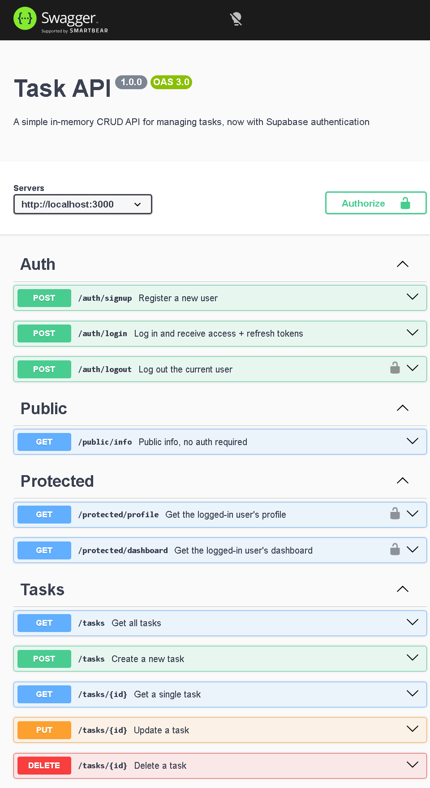

# Task API

A CRUD API for managing a to-do list, built with Node.js and Express — now with
**Supabase-powered authentication** (sign up, log in, log out, protected routes, and
Swagger docs with bearer auth) on top of the existing Postgres-backed task store.

Data is stored in a **PostgreSQL** database running inside a **Docker container**, so it
survives server restarts and container restarts alike. User accounts, password hashing,
and JWT signing are handled by **Supabase Auth** — this app never stores or hashes a
password itself.

*This project started as an in-memory CRUD API (A1), was migrated to SQLite for file-based
persistence (A2), containerized with a real PostgreSQL database running in Docker (A3),
and now (A4) has a full authentication layer on top: signup/login via Supabase, JWT
verification, a reusable auth middleware guarding protected routes, and interactive
Swagger docs with a bearer-token "Authorize" flow.*

## How to run

You need [Docker Desktop](https://www.docker.com/products/docker-desktop/) installed and
running, and a free [Supabase](https://supabase.com) project (for auth).

```bash
cp .env.example .env
docker compose up
```

That's it — this single command builds the app image, starts the Postgres database in
its own container, and starts the API. No local Node.js or Postgres installation needed.

Server runs on http://localhost:3000
Swagger docs run on http://localhost:3000/docs

The `tasks` table is created automatically the first time the app runs, along with 3
seeded example tasks (only if the table is empty). Data lives in a Docker volume, so it
survives `docker compose down` + `docker compose up` — the container can be destroyed
and recreated, and your tasks are still there.

To stop everything:
```bash
docker compose down
```

## Configuration

The app reads its configuration from environment variables, defined in a `.env` file
(git-ignored, never committed):

```
DATABASE_URL=postgres://postgres:dev@db:5432/tasks
SUPABASE_URL=your_supabase_project_url
SUPABASE_KEY=your_supabase_anon_key
PORT=3000
```

`.env.example` is committed with these same key names but placeholder values, so anyone
cloning the repo knows exactly which variables to set — no real secrets ever leave this
machine.

**Getting your Supabase values:** create a free project at
[supabase.com](https://supabase.com), then go to **Project Settings → API** and copy the
**Project URL** and the **anon key** (never the `service_role` key — that one bypasses
all security and must stay secret). Also go to **Authentication → Sign In / Providers →
Email** and turn **"Confirm email" off**, so a fresh signup can log in immediately
without checking an inbox (fine for this practice project; you'd leave it on in
production).

## Endpoints

| Method | Path                  | Auth required?          | Description                          |
|--------|-----------------------|--------------------------|---------------------------------------|
| GET    | /                     | No                       | API info                              |
| GET    | /health               | No                       | Health check                          |
| POST   | /auth/signup          | No                       | Register a new user                   |
| POST   | /auth/login           | No                       | Log in, returns access + refresh token|
| POST   | /auth/logout          | Yes — `Bearer <token>`   | Log out the current user              |
| GET    | /public/info          | No                       | Public message, open to anyone        |
| GET    | /protected/profile    | Yes — `Bearer <token>`   | Get the logged-in user's profile      |
| GET    | /protected/dashboard  | Yes — `Bearer <token>`   | Get the logged-in user's dashboard    |
| GET    | /tasks                | No                       | List all tasks                        |
| GET    | /tasks/:id            | No                       | Get one task                          |
| POST   | /tasks                | No                       | Create a task                         |
| PUT    | /tasks/:id            | No                       | Update a task                         |
| DELETE | /tasks/:id            | No                       | Delete a task                         |
| GET    | /stats                | No                       | Task counts (total, done, open)       |
| POST   | /reset                | No                       | Reset database to 3 default tasks     |

## Authentication flow

Authentication is a trust triangle between the client, this server, and **Supabase**
(the Identity Provider):

1. Client sends `email` + `password` to `POST /auth/signup` or `POST /auth/login`.
2. Supabase checks the credentials and returns a signed **JWT** (`access_token`) plus a
   `refresh_token`.
3. The client attaches that JWT to protected requests as an `Authorization: Bearer
   <token>` header.
4. This server verifies the token with Supabase (`supabase.auth.getUser(token)`) before
   letting the request through — an expired, tampered, or missing token is rejected with
   `401`.

This server never hashes a password or invents its own signing logic — Supabase does
that; the server's job is only to forward credentials and verify the tokens it gets
back.

### Example: signup → login → protected route (PowerShell)

```powershell
# Sign up
$body = @{ email = "test@example.com"; password = "password123" } | ConvertTo-Json
Invoke-RestMethod -Uri "http://localhost:3000/auth/signup" -Method Post -ContentType "application/json" -Body $body

# Log in
$result = Invoke-RestMethod -Uri "http://localhost:3000/auth/login" -Method Post -ContentType "application/json" -Body $body
$token = $result.access_token

# Call a protected route
Invoke-RestMethod -Uri "http://localhost:3000/protected/profile" -Method Get -Headers @{ Authorization = "Bearer $token" }
```

A tampered token (`$token + "x"`) on the same route returns `401 Invalid or expired
token`.

## Swagger UI

Interactive API docs, with a bearer-auth "Authorize" flow, are served at
`http://localhost:3000/docs`. Routes that need a token (`/auth/logout`,
`/protected/profile`, `/protected/dashboard`) show a lock icon. Click **Authorize** in
the top right, paste an access token (no `Bearer` prefix needed — Swagger adds that),
then use **Try it out** on any protected route to call it straight from the browser.



## Example request (tasks)

On Windows PowerShell, `curl` is aliased to `Invoke-WebRequest`, which does not accept
Linux-style `-i` flags the same way — so requests here are made with `Invoke-WebRequest`
directly (equivalent to `curl -i`, showing status code, headers, and body).

```powershell
Invoke-WebRequest -Uri "http://localhost:3000/tasks" -Method Get
```

Real output, captured against the running Postgres-backed stack:

```
StatusCode        : 200
StatusDescription : OK
Content           : [{"id":1,"title":"Buy groceries","done":false},{"id":2,"title":"Finish assignment","done":false},{"id":3,"title":"Read a book","done":true},{"id":4,"title":"Persistence test task","done":false}]
RawContent        : HTTP/1.1 200 OK
                    Connection: keep-alive
                    Keep-Alive: timeout=5
                    Content-Length: 194
                    Content-Type: application/json; charset=utf-8
                    Date: Wed, 26 Aug 2026 12:34:34 GMT
                    ETag: W/"c2-dYNKQ1PmiNfuYLLtO6J..."
RawContentLength  : 194
```

Task with `id: 4` ("Persistence test task") is the task created during the Stage 4
persistence check — it survived a full `docker compose down` + `docker compose up`
cycle, confirming the volume kept the data.

---

## Database

### Why PostgreSQL, in Docker?
SQLite (used in A2) needed no server — just one file. PostgreSQL is a real database
*server*, the same kind that powers production backends. Running it in Docker means no
manual Postgres install, no version conflicts — `docker run` (or `docker compose up`)
gives a real, disposable, identical-everywhere database in seconds.

### Where the database lives
Postgres runs in its own container (`db` service in `compose.yaml`), storing its data in
a named Docker **volume** (`taskdata`). This means the data lives outside the container
itself — the container can be removed and recreated, and the data survives, because the
volume persists independently.

The `tasks` table (`id serial primary key, title text, done boolean`) is created
automatically on first run using `CREATE TABLE IF NOT EXISTS`. Three example tasks are
seeded only when the table is empty, so restarting the app never duplicates them.

### Proof of persistence
Tasks created through `POST /tasks` are written directly to Postgres. Stopping the app
(even `docker compose down`, which removes the containers) does not clear the data —
because the volume, not the container, is where the rows actually live. Running
`docker compose up` again reconnects to the same volume and the same rows are still
there.

### Database screenshot


*(Screenshot taken via `docker exec -it todo-api-db-1 psql -U postgres -d tasks -c "\dt"`
and `SELECT * FROM tasks;`, showing the seeded and created tasks.)*

### Example SQL query
```sql
SELECT * FROM tasks;
```
This lists every task currently in the database — confirming that tasks created through
the API are actually saved to Postgres and survive both an app restart and a full
`docker compose down` / `up` cycle, not just kept in memory or a single container.

### Parameterized queries
All queries that use user input (`WHERE id = $1`, `INSERT INTO tasks (title, done)
VALUES ($1, $2)`, etc.) use Postgres's `$1, $2, ...` placeholders instead of gluing
values directly into the SQL string. This keeps the database safe from SQL injection.

---

## Security notes

- **No custom cryptography.** Password hashing and JWT signing are entirely handled by
  Supabase — this app never rolls its own auth logic.
- **anon key, not service_role key.** Only the public `anon` key is used from this
  server; the `service_role` key (which bypasses all security) is never used here and
  never committed.
- **Every protected route goes through one middleware** (`requireAuth` in `index.js`),
  so adding a new protected route never means re-writing token-verification logic — it
  just means adding the middleware to the route.
- **`.env` is git-ignored** and was never committed; `.env.example` ships with key names
  only, no real values.

---

## The stack, in one file

`compose.yaml` describes two services:

- **api** — built from the project's `Dockerfile`, runs the Express app on port 3000
- **db** — the official `postgres` image, with a named volume for persistent storage

Inside the Docker network, the app reaches the database using the service name `db`
(e.g. `db:5432`), not `localhost` — Docker Compose's internal DNS resolves service names
to the right container automatically.

## Testing on Windows / PowerShell

For `GET` requests, `Invoke-WebRequest` works directly (see the example above). For
`POST` / `PUT` requests that need a JSON body, build the body as a PowerShell object
first, since PowerShell's quoting doesn't pass raw JSON strings the way Linux `curl`
does:

```powershell
$body = @{ title = "Buy milk"; done = $false } | ConvertTo-Json
Invoke-RestMethod -Uri "http://localhost:3000/tasks" -Method Post -ContentType "application/json" -Body $body
```